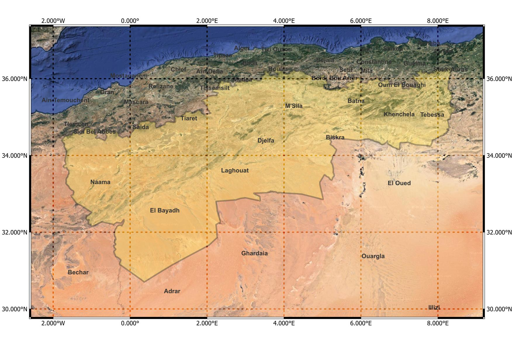
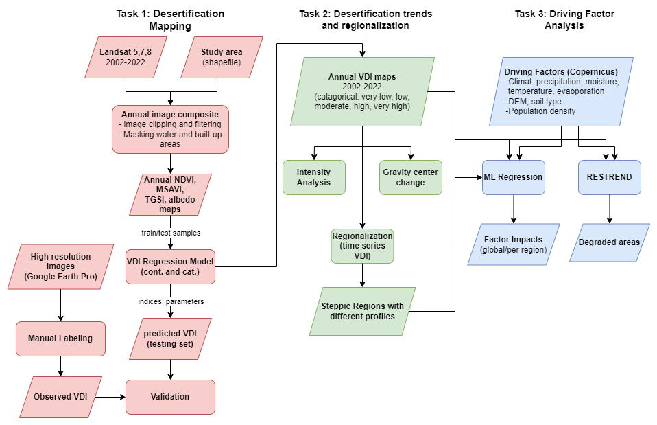
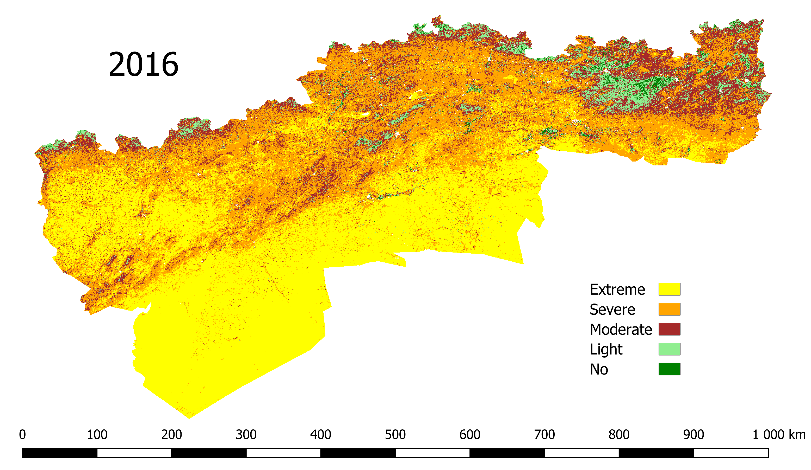
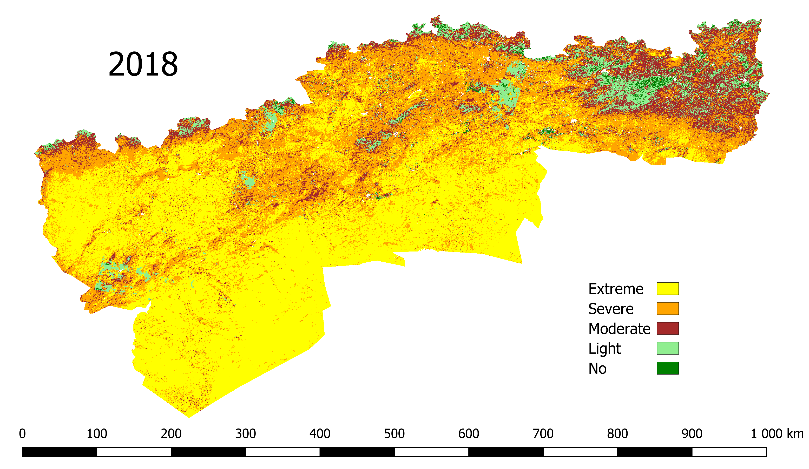

# MAPSPADES: Mapping and Monitoring Spatiotemporal Desertification Patterns in the Steppic Belt of Algeria

  
  &nbsp;&nbsp;&nbsp;&nbsp;&nbsp;&nbsp;
  
  &nbsp;&nbsp;&nbsp;&nbsp;&nbsp;&nbsp;
  
  &nbsp;&nbsp;&nbsp;&nbsp;&nbsp;&nbsp;
  
  &nbsp;&nbsp;&nbsp;&nbsp;&nbsp;&nbsp;
  

---

MAPSPADES is a research project involving the [University of Oran 1](https://univ-oran1.dz/?lang=en) (Algeria) and [ITC/University of Twente](https://www.itc.nl/) (Netherlands) supported by the [EO Africa R&D Facility](https://www.eoafrica-rd.org/). It provides an analytical workflow to map the spatiotemporal evolution of desertification in the Algerian steppe from 2002 to 2022 and to understand its driving factors. It takes advantage of the availability of Earth observation data, as well as statistical and machine learning techniques to detect land cover change and assess land degradation over time. The developed methodology is intended to be both reproducible and applicable to other exposed geographical areas. The implemented workflow supports decision makers to have a better view and control over the desertification progress and the areas where strong mitigation measures should be implemented.

## Contents

- [Context](#context)
- [Worflow](#workflow)
- [EO Data Sources](#eo-data-sources)
- [Notebooks](#notebooks)
- [Dataset](#dataset)
- [Team Members](#team-members)

## Context
Desertification is a major environmental issue that threatens many parts of the globe. Between the 1980s and 2000s, deserts expanded to over 9% of drylands, impacting the lives of over 500 million people in 2015[(1)](https://www.ipcc.ch/site/assets/uploads/sites/4/2022/11/SRCCL_Chapter_3.pdf). It could be defined as a type of land degradation in arid, semi-arid and dry sub-humid areas resulting from climatic variations and human activities. As a result, fewer soils are able to support crops, livestock and wildlife, natural vegetation is degraded permanently, and many people have no choice but to migrate to urban areas or even beyond the country.

Algeria is one of the countries most affected by desertification, as evidenced by a high loss of indigenous plant biodiversity between 1975 and 2006[(2)](https://link.springer.com/article/10.1007/s40333-018-0095-x). Desert already occupies nearly 2 million km² (80\% of the total land area) and nearly 8 out of 20 million hectares that constitute the steppe are classified as vulnerable to desertification[(3)](https://journals.openedition.org/vertigo/15152). This region, which stretches over 1200 km, is of great strategic importance as it forms a natural buffer between the Sahara and the fertile lands of the north.  

  

## Workflow

  

## EO Data Sources

- [Landsat](https://landsat.gsfc.nasa.gov/data/) multispectral images (30 m of resolution) with atmospherically corrected surface reflectance (data from 2002 to 2013 are based on MSS and ETM+ Landsat 5 and 7 sensors, respectively; data from 2014 to 2022 are based on Landsat 8 OLI). 
-	[ESA WorldCover 10 m 2021](https://worldcover2021.esa.int/) to mask out built-up and water areas. 
-	High resolution images of 30 m × 30 m (corresponding to the Landsat resolution) from [Google Earth Pro](https://www.google.com/earth/about/versions/), representing different locations in the study area. 1000 images were downloaded to validate our model.
-	Climate data from ECMWF ERA5 (data was downloaded through the [Copernicus Climate Data Store](https://cds.climate.copernicus.eu/cdsapp#!/dataset/reanalysis-era5-single-levels?tab=overview) using [ERA5 CLI](https://era5cli.readthedocs.io/en/stable/)).

## Notebooks

| Name  | Description  |
|---|---|
| [Sampling of control points](control_points_sampling.ipynb)  | From the raster file of the study area divided into 5 classes of vegetation condition (generated using K-mean clustering of average mesured NDVI, MSAVI, Albedo, TGSI in a given year), we sample a balanced list of reference points with an arbitrary date that are used to build the vegetation model.|
| [VDI model](vdi-model.ipynb) | Given the set of control points, we build a linear regression model to calculate composite vegetation index, we call Vegetation Density Index (VDI), from two spectral indices (NDVI, MSAVI, TGSI, Albedo) |
| [VDI raster](vdi-raster.ipynb) | Generate both a categorical and a continuous VDI raster for a given year according to two input rasters of different spectral indices and a linear model combining these indices. Categorical maps are obtained by mapping continuous values 5 classes after determining the boundaries of each class using the well-known Jenks natural break algorithm. The classes indicate different levels of vegetation density: Extremly Low, Low, Moderate, High, Very High.Two examples of vegetation maps are shown below.|
| [Intensity analysis](intensity-analysis-R.ipynb) | Execute *Intensity analysis*, which is a method for quantitative analysis of land use and land cover change. It uses a transfer matrix to analyze the land type map at different time points in the same region and obtains different patterns of land cover change at the interval, category, and transition levels (written in R). |  
| [Intensity analysis diagrams](intensity-analysis-diagrams.ipynb) | Generate different diagrams and files related to intensity analysis (some examples are in the folder *results*).|  
| [Sankey plot](sankey.ipynb) | Generate a sankey plot showing transitions between classes every 4 years.| 
| [Gravity center change](gravity-center-analysis.ipynb) | Calculate the gravity centers of different VDI classes and analyze their change in distance and direction over time.|  
| [RESTREND](restrend.ipynb) | Implement residual trend analysis of VDI against precipitation and soil water to reveal degraded areas.| 
| [RESTREND with Kendal coefficients](Mann_Kendal.ipynb) | Alternative non-parametric method to examine the consistency of RESTREND results.| 
| [Region classification](region-classification.ipynb) | Infer the region label from the a time series of driving factors using random forest classification. This is a complementary way to determine the appropriate number of contiguous regions previously obtained from the Skater clustering algorithm.|  
| [Analysis of driving factors](driving-factors-analysis.ipynb) | Build a random forest regressor at the regional level (subdivision of the study area) to predict the annual VDI at the 5km scale from several driving factors, such as annual precipitation, average soil moisturen, wind speed or population density. Then, we apply techniques like permutation importance or SHAP to evaluate the impact of each feature on the output.|

  
  &nbsp;&nbsp;&nbsp;&nbsp;&nbsp;&nbsp;
  

## Dataset

The data files (in tiff or shapefile format) required to run the Jupyter notebooks are available from the following links:
- Kaddour et al, 2024, "HR Images Algerian steppic zone", https://doi.org/10.17026/PT/POJGN2 , DANS Data Station Physical and Technical Sciences, DRAFT VERSION
- Kaddour et al, 2024, "RS based driving factors of desertification in the Algerian steppic zone", https://doi.org/10.17026/PT/0DNFS0, DANS Data Station Physical and Technical Sciences, DRAFT VERSION
Once downloaded, they should be placed in the folder *rasters*.

## Team Members 

- [Mejdi Kaddour](https://www.linkedin.com/in/mejdi-kaddour-71610b66/?originalSubdomain=dz), LITIO Laboratory & University of Oran 1, Algeria.
- [Lucas De Oto](https://people.utwente.nl/l.h.deoto), ITC, University of Twente, Enschede, The Netherlands.
- [Amel Faiza Tandjaoui](https://www.linkedin.com/in/ameltandjaoui/?locale=en_US), LGEM Laboratory & Higher School of Electrical and Energetic Engineering of Oran, Algeria.
- [Hachem Guerid](https://www.linkedin.com/in/guerid/?originalSubdomain=dz), LITIO Laboratory & University of Sciences and Technology of Oran Mohamed-Boudiaf, Algeria.
- [Mahdi Khodadadzadeh](https://people.utwente.nl/m.khodadadzadeh), ITC, University of Twente, Enschede, The Netherlands.

