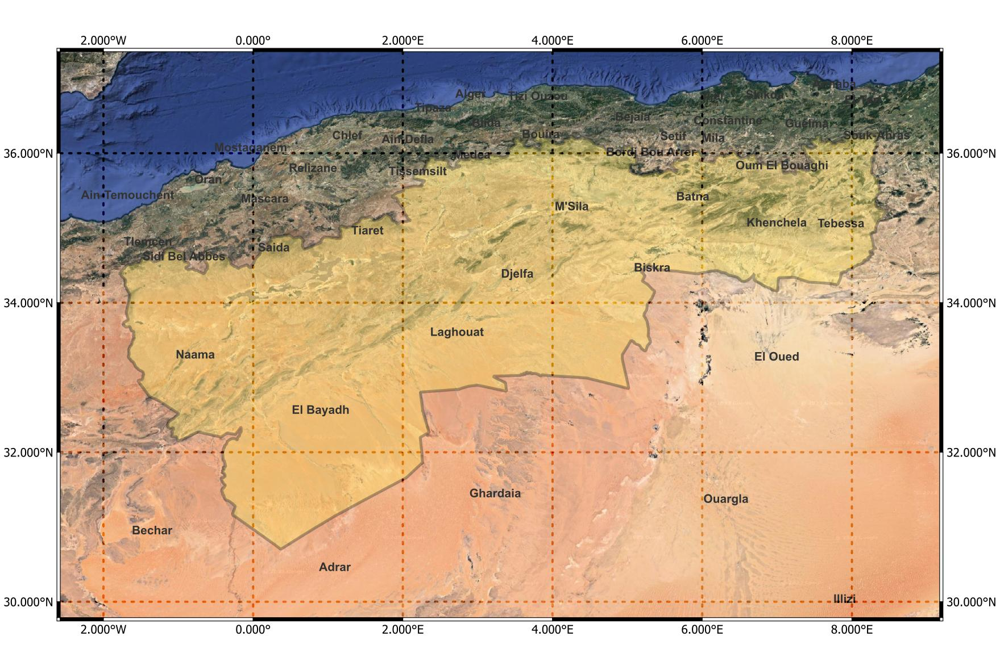

# MAPSPADES: Mapping and Monitoring Spatiotemporal Desertification Patterns in the Steppic Belt of Algeria

Desertification is a major environmental issue that threatens many parts of the globe. Between the 1980s and 2000s, deserts expanded to over 9% of drylands, impacting the lives of over 500 million people in 2015 [1]. It could be defined as a type of land degradation in arid, semi-arid and dry sub-humid areas resulting from climatic variations and human activities. As a result, fewer soils are able to support crops, livestock and wildlife, natural vegetation is degraded permanently, and many people have no choice but to migrate to urban areas or even beyond the country.

Algeria is one of the countries most affected by desertification, as evidenced by a high loss of indigenous plant biodiversity between 1975 and 2006 [2]. Past interventions such as the Green Dam project have failed to stop or reverse this trend [1]. Desert already occupies nearly 2 million km² (80\% of the total land area) and nearly 8 out of 20 million hectares that constitute the steppe are classified as vulnerable to desertification [3]. This region, which stretches over 1200 km, is of great strategic importance as it forms a natural buffer between the Sahara and the fertile lands of the north.  

<p align="center">
  
</p>


## Table of Contents

- [Features](#features)
- [Installation](#installation)
- [Usage](#usage)
- [Contributing](#contributing)
- [License](#license)

## Features

List the key features of your project.

## Installation
<span style="color: red;">This</span> is a word with a different color.
Provide instructions on how to install your project. Include any dependencies and steps required to get your project up and running.

```bash
# Example installation command
npm install your-package-name
